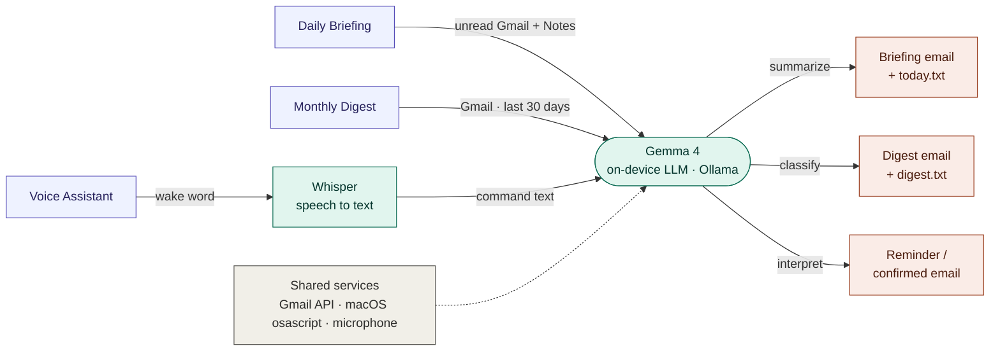

# Beacon

**A local, privacy-first personal assistant for macOS.** It reads your Gmail and
Apple Notes and helps you stay on top of them — a daily briefing, a monthly inbox
digest, and an always-on voice assistant for reminders and email. Every bit of AI
runs **on-device** through [Ollama](https://ollama.com): your mail and notes never
leave your machine. The only network calls are to your own Gmail.

## What it does

- **Daily briefing** (`briefing.py`) — summarizes unread Gmail + recent Apple
  Notes into a prioritized to-do list, emailed to you each morning.
- **Monthly digest** (`digest.py`) — classifies the last 30 days of mail into
  Action / Travel / Orders / Returns / Subscriptions / FYI and emails a digest.
- **Voice assistant** (`voice_assistant/`) — say a wake word, then speak: it sets
  reminders (with macOS alerts) and sends email to an allowlisted contact, after
  reading the draft back and waiting for your "send". See
  [voice_assistant/README.md](voice_assistant/README.md).

## Architecture

All three tools follow the same shape — **gather input → one on-device Gemma
model → take action** — so they share the Gmail plumbing and the local LLM.



<sub>purple = app · teal = on-device AI · coral = output · gray = shared service</sub>

Everything sits on three shared services: the **Gmail API** (OAuth),
**macOS `osascript`** (Notes, Messages, Notifications), and the **microphone**.
Nothing is sent to the cloud — Whisper handles transcription and Gemma handles
reasoning/classification, both locally.

## Example output

A morning briefing lands in your inbox (and `today.txt`):

```text
📋  Daily Briefing — Monday, July 6

TODAY'S PRIORITIES
1. Reply to the contract from Acme Legal (due today)
2. Confirm the 3 pm dentist appointment (they asked to reschedule)
3. Pay the internet bill before Friday's auto-charge

FYI
*   Your order from Bookshop ships tomorrow.
*   Two newsletters were skipped as noise.
```

Stay in flow while keeping track of what matters. The voice assistant answers
with native macOS banners — while you're deep in focus work, ask it to remind
you after a set interval or on a recurring schedule, and a timely nudge lands
right on your desktop. Say *"hey guru, remind me to drink water every hour,"*
and you get a **Reminder scheduled** acknowledgment now, then a **Reminder —
drink water** banner right on time, every hour.

## Requirements

- macOS (uses Apple Notes / Messages / Notifications via `osascript`)
- Python 3.11+
- [Ollama](https://ollama.com) with a model pulled: `ollama pull gemma4:e2b`
- A Google Cloud OAuth client (Gmail API enabled)

## Setup

```bash
# 1. Environment
python3 -m venv venv
venv/bin/pip install -r requirements.txt                     # briefing + digest
venv/bin/pip install -r voice_assistant/requirements.txt     # voice assistant

# 2. Google OAuth — create a Desktop OAuth client at console.cloud.google.com
#    (Gmail API enabled), download it as credentials.json into this folder.
#    See credentials.json.example for the expected shape.

# 3. Gmail sending for briefing/digest — copy the template and fill it in:
cp .env.example .env            # then edit GMAIL_ADDRESS + GMAIL_APP_PASSWORD
#    (app password from myaccount.google.com/apppasswords — not your login)

# 4. Voice assistant settings + contacts (both optional, both gitignored):
cp voice_assistant/.env.example voice_assistant/.env
#    real contacts go in voice_assistant/contacts.local.json (see config.py)
```

## Usage

```bash
venv/bin/python briefing.py     # daily briefing
venv/bin/python digest.py       # monthly digest
./run.sh                        # voice assistant (always-on)
```

## Configuration & secrets

No secrets live in the code. Everything sensitive is read at runtime and is
gitignored:

| File | Purpose | Tracked? |
|------|---------|----------|
| `.env` | `GMAIL_ADDRESS`, `GMAIL_APP_PASSWORD` | no |
| `credentials.json` | Google OAuth client | no |
| `token.json`, `voice_assistant/token_assistant.json` | OAuth tokens | no |
| `voice_assistant/.env` | assistant settings (wake word, model, …) | no |
| `voice_assistant/contacts.local.json` | your real email allowlist | no |

Templates (`*.example`) and placeholder defaults are committed so a fresh clone
knows what to fill in.

## Layout

```
briefing.py            digest.py            envtools.py        run.sh
requirements.txt       credentials.json.example
voice_assistant/       # the always-on voice assistant (its own README)
```

## Notes

- The voice assistant supports three wake-word engines: built-in phrases
  (openWakeWord), a custom phrase via Picovoice Porcupine, or an account-free
  Whisper phrase-spotter. Details in [voice_assistant/README.md](voice_assistant/README.md).
- This is a personal project; review the code before pointing it at your own
  Gmail.

## License

MIT — see [LICENSE](LICENSE).
